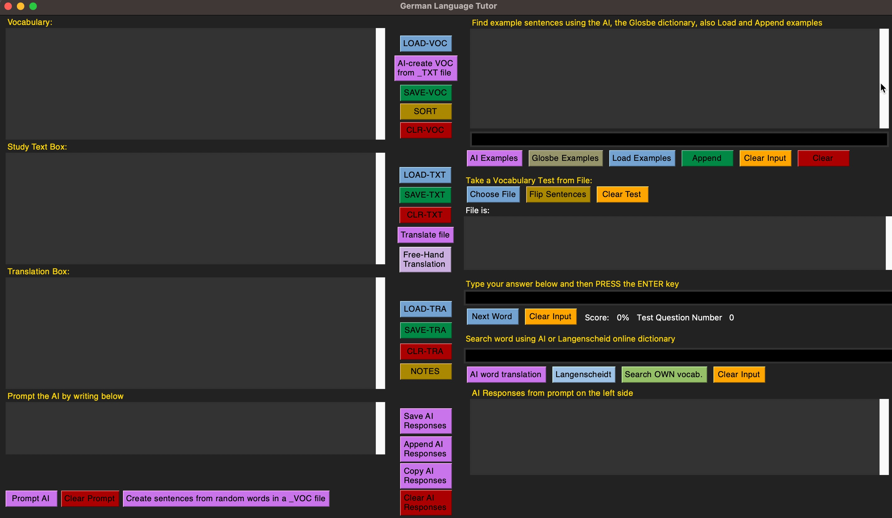

# THE ESSENCE OF THIS PROGRAM is to help users learn or improve on their German THROUGH German texts.
FIND a German text on the Internet (Magazine, Newspaper, or other source). COPY a piece of the text that you find interesting and PASTE it in the 'Study Text Box' of the interface, Click the green button SAVE-TXT, and select the place on your computer to save the text. If you named the file, for example as, 'sports' the name of this .txt file will automatically be renamed as 'sports_TXT.txt'. Click on the pinkish button 'AI-create VOC from _TXT file' and select 'sports_TXT.txt'. The program will list the most important words of this file in the 'Vocabulary' above the 'Study Text Box'. This is your vocabulary. Save it by clicking 'SAVE-VOC' and name the file 'sports' which will automatically be renamed as 'sports_VOC.txt'. To translate the original file, click 'Translate file' to select the file of your choice (which has the suffix of *_TXT.txt), and the file will be translated and be displayed in the 'Translation Box'. In keeping with the previous example-file, the translation will be saved as 'sports_TRA.txt'.

## Screenshot


This program is workable and 99% finished. Minor changes to the GUI are pending.

I often use the following source: Deutsche Gesellschaft für Internationale Zusammenarbeit (GIZ) at:
https://www.giz.de/de/html/index.html

A detailed MANUAL will be provided soon.

This program 'deutch_learn.py', has been design to facilitate users learn German, but with some minor adaptations it can be used to facilitate users in learning other languages.
To use the Artificial Intelligence buttons in this program, users must have an API key from OpenAI (ChatGPT)
This program is an adaptation of 'Deutch_Trainer-copy2.py', in "German-Learning" repository, which makes use of the Gemini API and runs on Windows.

# More Details:

This is a Python-based German language tutoring application that leverages AI for sentence generation, provides vocabulary testing, translation tools, and integrates with online dictionaries.

## Features

- Vocabulary management (load, save, sort, clear)
- AI-driven sentence generation from vocabulary
- Study text loading, saving, and translation
- Free-hand translation capture
- Vocabulary testing mode with scoring
- AI-powered word translation and online dictionary search (Langenscheidt, Glosbe)
- AI responses to user prompts

## Prerequisites

Before you begin, ensure you have the following installed on your system:

-   **Python 3.11 or newer**: [Download Python](https://www.python.org/downloads/)
-   **Git**: [Download Git](https://git-scm.com/downloads)

## Setup and Installation

Follow these steps to get the application up and running on your local machine:

1.  **Clone the Repository:**
    Open your terminal or command prompt and clone the project to your local machine:
    ```bash
    git clone [https://github.com/GTrialonis/MeinDeutsch.git](https://github.com/GTrialonis/MeinDeutsch.git)
    ```

2.  **Navigate into the Project Directory:**
    ```bash
    cd MeinDeutsch
    ```

3.  **Create a Virtual Environment:**
    It's highly recommended to use a virtual environment to manage project dependencies.
    ```bash
    /usr/local/bin/python3.11 -m venv venv_deutch_tutor
    ```
    *(Note: If `/usr/local/bin/python3.11` does not work, try `python3 -m venv venv_deutch_tutor` or check your Python 3.11+ installation path.)*

4.  **Activate the Virtual Environment:**
    * **On macOS/Linux:**
        ```bash
        source venv_deutch_tutor/bin/activate
        ```
    * **On Windows (Command Prompt):**
        ```bash
        .\venv_deutch_tutor\Scripts\activate.bat
        ```
    * **On Windows (PowerShell):**
        ```bash
        .\venv_deutch_tutor\Scripts\Activate.ps1
        ```
    *(Your terminal prompt should now show `(venv_deutch_tutor)` to indicate the environment is active.)*

5.  **Install Dependencies:**
    With the virtual environment active, install all required Python packages:
    ```bash
    pip install -r requirements.txt
    ```

6.  **Set Up Your OpenAI API Key (`.env` file):**
    This application uses the OpenAI API for AI-powered features. You need to obtain an API key and set it up:
    * Go to the [OpenAI Platform website](https://platform.openai.com/).
    * Create an account or log in.
    * Navigate to "API keys" and create a new secret key.
    * In the root of your `MeinDeutsch` project directory, create a new file named **`.env`** (make sure it's exactly `.env`, with a dot at the beginning and no other extension).
    * Open this `.env` file in a text editor and add the following line, replacing `your_openai_api_key_here` with your actual key:
        ```
        OPENAI_API_KEY=your_openai_api_key_here
        ```
    * Save and close the `.env` file. **Keep this file private and never share it or commit it to Git!** (It's already in the `.gitignore` file of this repository.)

## Running the Application

Once all steps above are completed:

1.  Ensure your virtual environment is active (`(venv_deutch_tutor)` in your terminal).
2.  Run the main application script:
    ```bash
    python deutch_learn.py
    ```
    The German Language Tutor GUI should now appear.

## Deactivating the Virtual Environment

When you are done working on the project, you can deactivate the virtual environment:
```bash
deactivate
